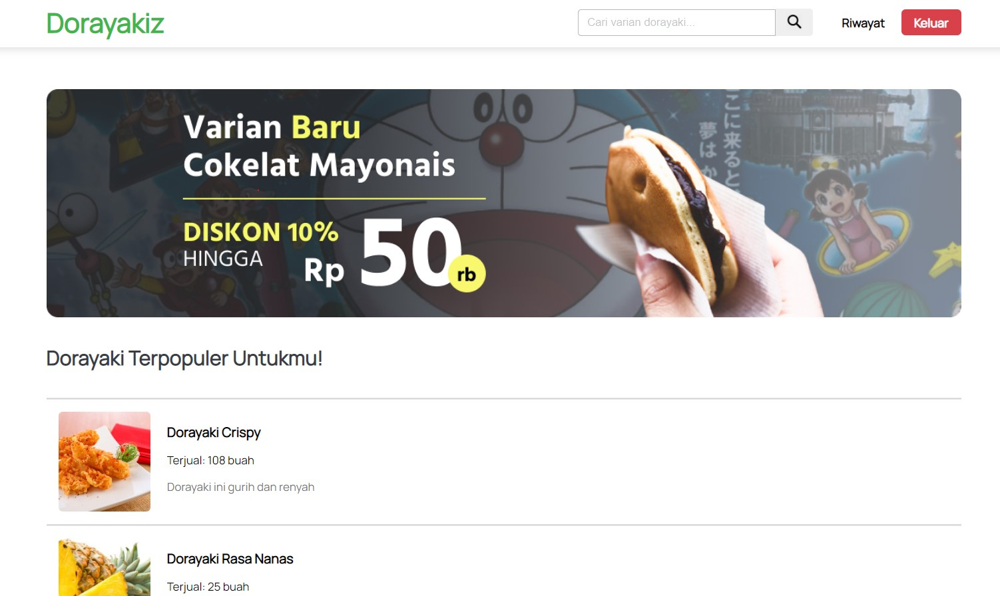
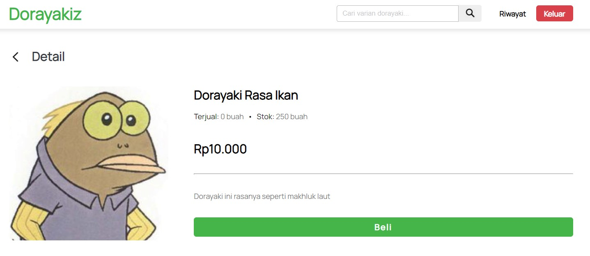
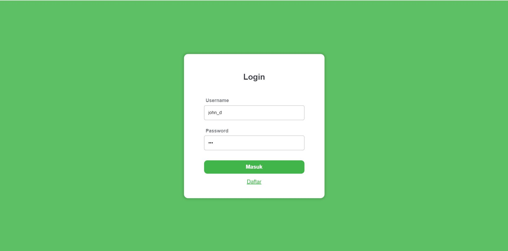
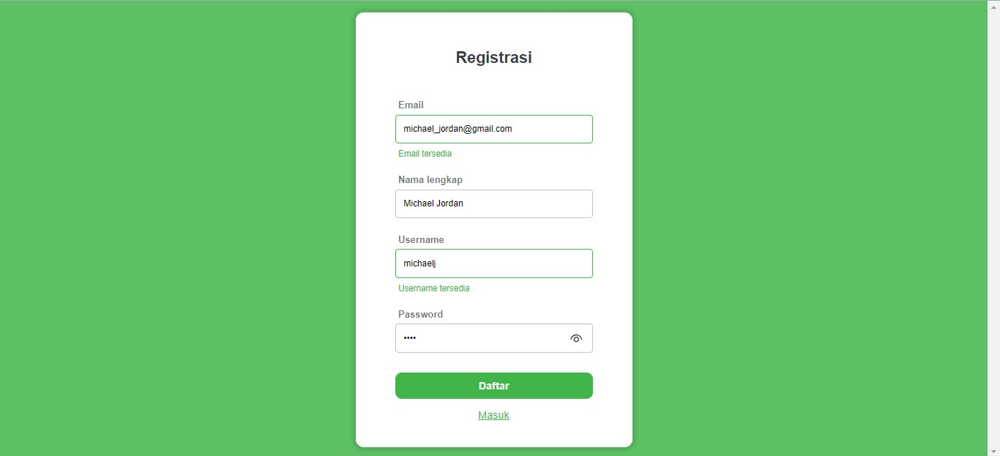
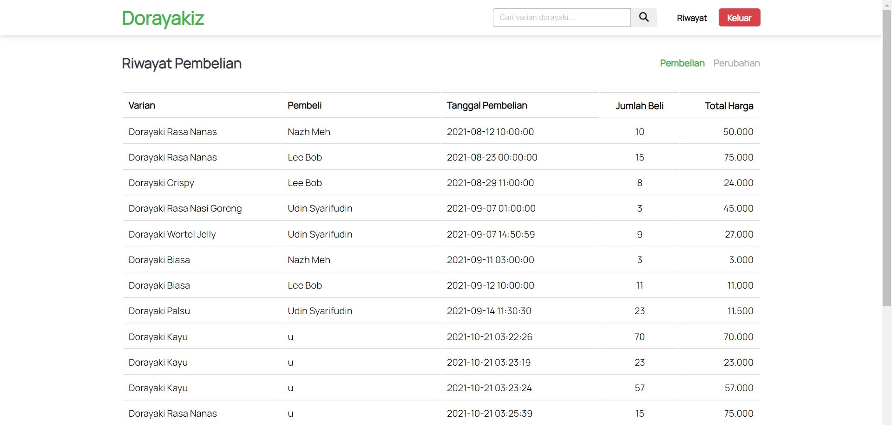

# Tugas Besar WBD 1 - IF3110-2021-01-20

## Doroyakiz: Dorayaki Management System

## Kelompok 20: haissem

-   13519058 - Dionisius Darryl Hermansyah
-   13519190 - Gregorius Dimas Baskara
-   13519209 - Wilson Tandya

## Deskripsi Aplikasi web

Aplikasi web yang dibangun merupakan sebuah sistem informasi yang digunakan untuk melakukan manajemen / pengelolaan stok dorayaki. Berikut ini merupakan spesifikasi dari aplikasi web:

1. Implementasi client-side menggunakan Javascript, HTML, dan CSS.
2. Implementasi server-side menggunakan PHP murni tanpa framework
3. Implementasi basis data menggunakan SQLite.
4. Sistem bersifat monolithic (interface dan logika pemrosesan digabung menjadi satu).

Fitur yang dimiliki aplikasi antara lain:

1. Seluruh pengguna harus melakukan autentikasi untuk dapat mengakses seluruh
   fitur lainnya. Pengguna dibedakan menjadi 2 kategori: user dan admin.
2. Admin dapat melakukan pengelolaan varian dorayaki.
3. Admin dapat melakukan manajemen stok dorayaki.
4. Admin dapat melihat riwayat perubahan stok dorayaki.
5. User dapat melihat daftar varian dorayaki
6. User dapat melakukan pembelian dorayaki
7. User dapat melihat riwayat pembelian dorayaki.

Spesifikasi bonus yang tersedia yaitu:

1. Data Expire Time
2. Responsive Design
3. Docker
4. Halaman Riwayat Pengubahan Stok / Pembelian Dorayaki

## Daftar Requirement

-   PHP 8
-   SQLite3

Untuk menjalankan server secara lokal tanpa Docker:

-   XAMPP

Untuk menjalankan dengan Docker:

-   OS Ubuntu / Windows dengan WSL2
-   Docker
-   Docker Compose

## Cara Instalasi

### XAMPP

**Aktivasi SQLite3 pada PHP**  
Jika extension SQLite3 belum teraktivasi pada PHP:

1. Buka php.ini in C:\xampp\php
2. Tambahkan / uncomment kode ini

```bash
extension=sqlite3
extension=pdo_sqlite
sqlite3.extension_dir = "C:\xampp\php\ext"
```

[Referensi tambahan](https://www.nyingspot.com/2017/10/cara-mengaktifkan-sqlite3-di-php-windows/)

## Cara Menjalankan server

### XAMPP

1. Clone repository ini pada directory htdocs XAMPP anda. Contohnya: `C:\xampp\htdocs\`
2. Buka XAMPP Control Panel dan Start service Apache
3. Aplikasi akan dijalankan pada `localhost/tugas-besar-1`
4. Untuk mengakses laman utama aplikasi, buka `localhost/tugas-besar-1/pages`

### Docker

1. Clone repository ini
2. Masuk ke directory utama (root) dari repository
3. Untuk menjalankan aplikasi, jalankan:

```bash
docker-compose up --build -d
```

4. Container akan berjalan dengan nama `tubes1_wbd_g20`
5. Aplikasi akan berjalan pada `localhost:80`
6. Untuk mengakses laman utama aplikasi, buka `localhost:80/pages` atau `localhost/pages`
7. Untuk menghentikan aplikasi, jalankan:

```bash
docker-compose stop
```

## Screenshot Tampilan Aplikasi

#### Dashboard



#### Search


#### Detail



#### Add Variant


#### Edit Stock


#### Delete


#### Purchase


#### Login



#### Register



#### Riwayat Pembelian



#### Riwayat Perubahan


## Pembagian Tugas

#### Server-side

| Item                        | NIM                |
| --------------------------- | ------------------ |
| Login                       | 13519190           |
| Register                    | 13519190           |
| Dashboard                   | 13519058, 13519209 |
| Pencarian Dorayaki          | 13519058           |
| Daftar Dorayaki             | 13519058           |
| Detail Dorayaki             | 13519058           |
| Tambah Varian Dorayaki      | 13519209           |
| Edit Stok Dorayaki          | 13519209           |
| Delete Dorayaki             | 13519209           |
| Pembelian Dorayaki          | 13519058           |
| Setup Basis Data            | 13519058           |
| Riwayat Pembelian           | 13519190           |
| Riwayat Perubahan           | 13519190           |
| Bonus: Data Expire Time     | 13519209           |
| Bonus: Docker               | 13519058           |
| Bonus: Riwayat              | 13519190           |

#### Client-side

| Item                        | NIM                          |
| --------------------------- | ---------------------------- |
| Login                       | 13519190                     |
| Register                    | 13519190                     |
| Dashboard                   | 13519058, 13519190, 13519209 |
| Pencarian Dorayaki          | 13519058                     |
| Daftar Dorayaki             | 13519058                     |
| Detail Dorayaki             | 13519058, 13519209           |
| Pembelian Dorayaki          | 13519058                     |
| Tambah Varian Dorayaki      | 13519209                     |
| Edit Stok Dorayaki          | 13519209                     |
| Bonus: Responsif            | 13519190                     |
| Bonus: Riwayat              | 13519190                     |